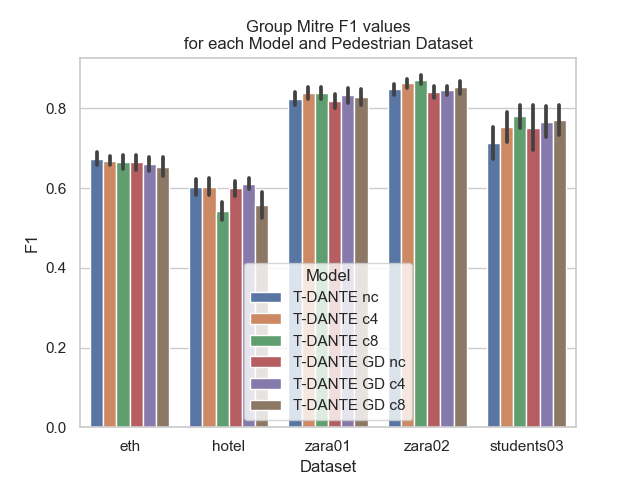
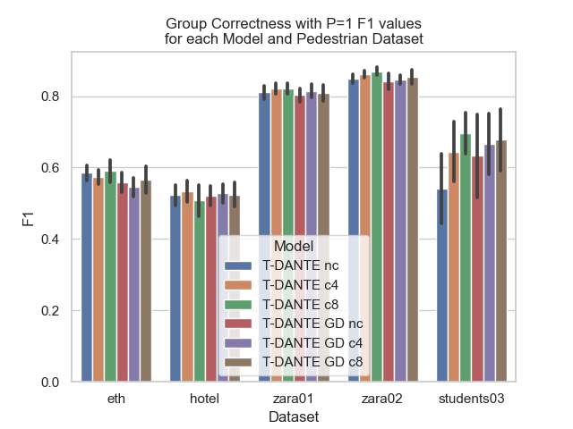
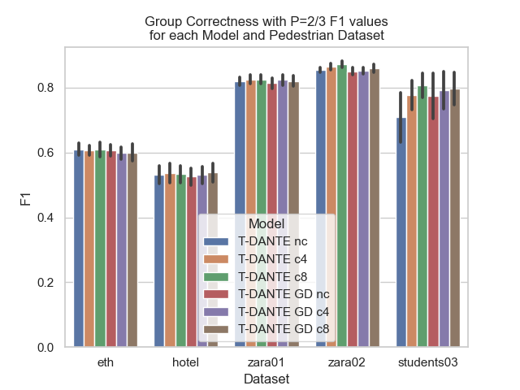
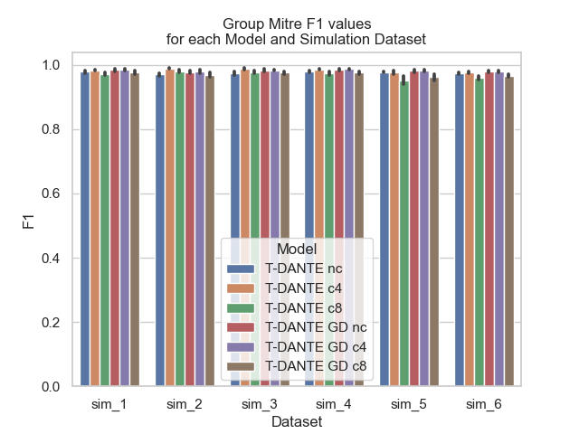
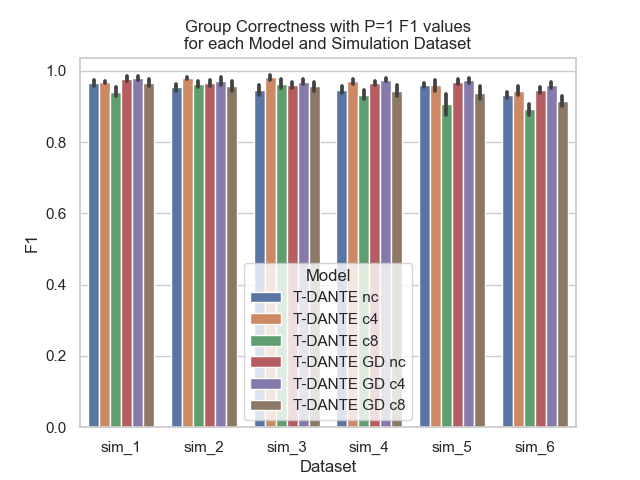
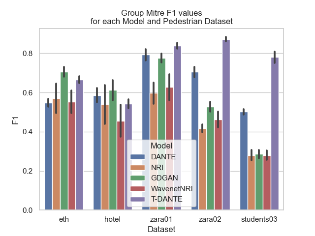
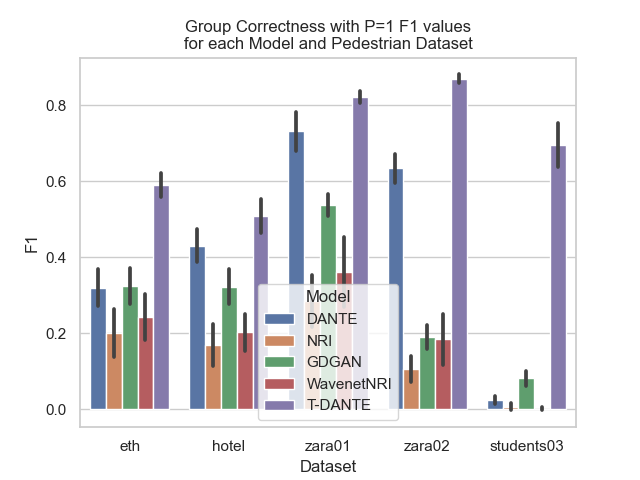
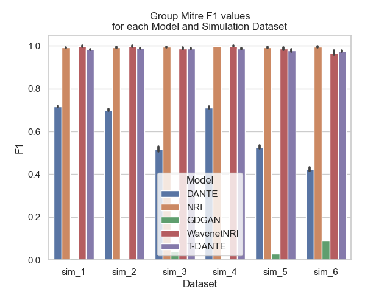
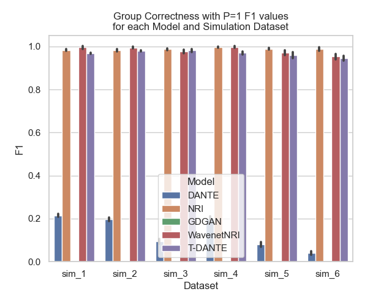

# Group Detection from Spatiotemporal Data using Social Context

[//]: # (todo add introduction)

## T-DANTE

In this section the architecture of our method is going to be introduced. The first thing to be discussed is the
approach
to learn the affinities between agents in a scene through the use of a Deep Neural Network (DNN). Since our network is
based on DANTE [[5]](#5) and we applied LSTM/GRU layers to include temporal features of spatiotemporal data, we
name our model T-DANTE. Figure 1 and Figure 2 give a visual
representation for the first and second part of our framework, respectively.


*Figure 1: Trajectories to affinity graph*


*Figure 2: Affinity graph community detection*

T-DANTE is a deep neural network (DNN) that predicts the weights for each of the edges in the
affinity graph (Figure 1). T-DANTE is structured to exploit two types of information: local spatial
information from the two nodes (individuals) connected to an edge of interest, and global spatial information from other
nearby people, who form the social context of the pair of interest. This is the idea introduced in DANTE by Swofford et
al. [[5]](#5). T-DANTE advances this idea by using LSTMs/GRUs that are making it possible to use data of multiple
past timeframes to decide the affinity score between two agents and not use only spatial features.

## Datasets

### Pedestrian Datasets


The chosen datasets for our experiments are 2 public pedestrian datasets containing multiple experiments with
information about group relationships. The first is BIWI Walking Pedestrian Dataset from Pellegrini et al. [[1]](#1)
which contains two experiments *ETH* and *Hotel*. The second is UCY dataset from
Lerner et al. [[2]](#2), which includes 3 experiments, namely *zara01*, *zara02* and
*students03*, with group information about the subjects. These datasets can be found at
[OpenTraj](https://github.com/crowdbotp/OpenTraj) and are commonly used as benchmarks for
group detection on spatiotemporal data.
The data of the aforementioned experiments consist of the location and the velocity of each agent for multiple time
frames. The ground truth of the agent groups is also included in the datasets.

### Simulation Datasets


In addition to experimenting with real world datasets, spring simulation data have been used in our experiments.
Simulation data are generated, so the ground truth is known and an infinite amount of data can be produced in order to
have enough data for our model to be trained. The spring simulation data that have been used were proposed by Kipf et
al. [[3]](#3) and were enriched by Nasri et al. [[4]](#4) with particle group information. The basic idea
is that a number of particles move in a 2-D space, simulating the concept of particles moving along with each other and
affecting the trajectory of each other. Locations and velocities of the particles are part of the generated data as well
as the communities that they belong to.

### Dataset Preprocessing


*Figure 3: Frames of reference*


*Figure 4: Fold splits*

The datasets need to be processed in order to be used by the input structure of T-DANTE.
At the beginning of the process we need to find all the possible scenes of size T, which is a parameter to handle the
number of timeframes that scenes consist of. In order for a number of timeframes to form a scene, they have to be
consecutive and no other timeframes exist between them. The only other constraint for a scene to be part of the dataset
is for at least 2 agents to appear in it. During the process of finding the scenes, we keep track of the groups and
the agents that are included in the scene, so we can use that information during the evaluation of our method.
In the subsequent stage of the dataset preprocessing we create samples extracted from the extracted scenes. For each
possible pair of agents in each scene, multiple samples are created, when enough agents are there, by using different
agents as part of the context of the pair of interest. Information about the groups of the scene, the label of the
affinity between the pair of agents of interest and the timeframe ids that constitute the scene is kept to be used in
later stages of splitting the dataset into fold and the evaluation of the model. The balance of the dataset is managed
by sampling with different rates pairs of agents that are in the same group and pairs of agents that are in different
groups. The spatial features of each agent are originally obtained in a world reference frame W. However, we transform
the features of each agent in the social context of a sample using a local frame of reference defined with respect to
the pair of individuals whose affinity a<sub>ij</sub> is being computed. This frame L<sub>ij</sub> is illustrated in
Figure 3 and is located at the middle point between agents i and j in the global frame W. This transformation of the
context features helps learning and generalisation of our approach. The last phase of the procedure is to split the
samples of the dataset into folds as a 5-fold cross validation approach is applied. In Figure 4 we try to visualise that
the samples are split into 5 parts, with 3 of them being the training set, 1 of them being the validation set and the
last 1 being the test set. The samples are split in that way so the data representing one scene are included in the same
set, in order to be able to construct the affinity graph that corresponds to a scene. For each fold the parts that
represent each set change in order for every part of the samples to be used in each one of the training, validation and
test sets.

In order to preprocess the pedestrian datasets you need to run [preparer.py](datasets/preparer.py) with the following
command

```
python preparer.py -f 15 -a 10 -sf "path_to_save_folder" 
```

The preprocessing of the simulation datasets has been implemented
in [simulation_preparer.py](datasets/simulation_preparer.py) that needs the following command to run

```
python simulation_preparer.py -f 49 -a 10 -sf "path_to_save_folder" 
```

## Baselines

1. DANTE

- Swofford et al. [[5]](#5) presented a data-driven approach to detect conversational groups. Their approach introduced
  a novel Deep Affinity Network (DANTE) to predict the likelihood that two agents in the same scene can be part of the
  same conversational group, considering their social context. In more detail, DANTE is a neural network that takes the
  location and head orientation data of a single frame scene and tries to learn the pairwise affinities between the
  agents by identifying their spacial arrangements. The predicted results for all agent pairs in the scene are then used
  by a clustering algorithm to identify groups of various sizes. This pipeline was also used to test interaction
  scenarios between a robot and humans. Instead of relying on head orientation, velocity data from our datasets is
  utilized for this baseline. The lack of temporal considerations for the problem is expected to make it unable to
  perform as well as our model.

2. GDGAN

- Fernando et al. [[7]](#7) implemented a novel deep learning framework for predicting human trajectories and
  detecting social group membership in crowds. The framework includes a generative adversarial network uses the
  spatiotemporal structure of the neighbourhood of an agent in order to identify attributes that describe the social
  identity of the agents. The authors are approaching the problem from an unsupervised learning point of view, allowing
  them to apply the pipeline to vaious settings without the need of labeling.

3. NRI

- Kipf et al. [[3]](#3) introduced Neural Relational Inference (NRI) model. NRI is an unsupervised model that
  learns to estimate interactions while at the same time learning the dynamics using observational data. In more detail,
  this model is a variational auto-encoder which learns the interactions between agents and is using graph neural
  networks in order to reconstruct the data.

4. WavenetNRI

- Nasri et al. [[4]](#4) used an NRI [[3]](#3) adaptation to perform group detection in spatiotemporal data. The model
  consists of a Graph Neural Network (GNN) encoder transformed by applying a Residual Dilated Causal Convolutional Block
  inspired by Wavenet architecture [[6]](#6). This work includes both supervised and unsupervised training.
  Louvain community detection algorithm is used to find the clusters of the interaction graphs formed by the predictions
  of the model. For our experiments we have used the supervised trained version as a baseline. This model uses whole
  scenes as samples, something that is different from our approach that uses only a specific amount of surrounding
  agents to predict the affinities.

## Experiments

### How to run

In order to train T-DANTE using a pedestrian dataset, you need to run the following command

```
python model.py -c path_to_config_file -f fold -e epochs --seed ${seed} -a 10 -f 15
```

For a simulation dataset the command is the following

```
python model.py -c path_to_config_file -f fold -e epochs --seed ${seed} -a 10 -f 15 --sim
```

The default T-DANTE configuration files are places in models/config/ folder and are named model_{dataset}.yml.
More information has to be defined in the configuration files.

### Results

#### Ablation Study

- Pedestrian datasets

  
  
  

- Simulation datasets

  
  
  

#### T-DANTE vs Baselines

- Pedestrian datasets

  
  
  

- Simulation datasets

  
  
  

## References

<a id="1">[1]</a>
Stefano Pellegrini, Andreas Ess, Konrad Schindler, and Luc Van Gool. You’ll never walk alone: Modeling social behavior
for multi-target tracking. In 2009 IEEE 12th International Conference on Computer Vision, pages 261–268. IEEE, 2009.

<a id="2">[2]</a>
Alon Lerner, Yiorgos Chrysanthou, and Dani Lischinski. Crowds by example. In Computer graphics forum, volume 26, pages
655–664. Wiley Online Library, 2007. 30

<a id="3">[3]</a>
Thomas Kipf, Ethan Fetaya, Kuan-Chieh Wang, Max Welling, and Richard Zemel. Neural relational inference for interacting
systems. In Jennifer Dy and Andreas Krause, editors, Proceedings of the 35th International Conference on Machine
Learning, volume 80 of Proceedings of Machine Learning Research, pages 2688–2697. PMLR, 10–15 Jul 2018.

<a id="4">[4]</a>
Maedeh Nasri, Zhizhou Fang, Mitra Baratchi, Gwenn Englebienne, Shenghui Wang, Alexander Koutamanis, and Carolien Rieffe.
A gnn-based architecture for group detection from spatio-temporal trajectory data. In Bruno Cr ́emilleux, Sibylle Hess,
and Siegfried Nijssen, editors, Advances in Intelligent Data Analysis XXI, pages 327–339, Cham, 2023. Springer Nature
Switzerland.

<a id="5">[5]</a>
Mason Swofford, John Peruzzi, Nathan Tsoi, Sydney Thompson, Roberto Mart ́ın-Mart ́ın, Silvio Savarese, and Marynel V
́azquez. Improving social awareness through dante: Deep affinity network for clustering conversational interactants.
Proc. ACM Hum.-Comput. Interact., 4(CSCW1), may 2020.

<a id="6">[6]</a>
A ̈aron van den Oord, Sander Dieleman, Heiga Zen, Karen Simonyan, Oriol Vinyals, Alexander Graves, Nal Kalchbrenner,
Andrew Senior, and Koray Kavukcuoglu. Wavenet: A generative model for raw audio. In Arxiv, 2016.

<a id="7">[7]</a>
Tharindu Fernando, Simon Denman, Sridha Sridharan, and Clinton Fookes. Gd-gan: Generative adversarial networks for
trajectory prediction and group detection in crowds. In C. V. Jawahar, Hongdong Li, Greg Mori, and Konrad Schindler,
editors, Computer Vision – ACCV 2018, pages 314–330, Cham, 2019. Springer International Publishing.
